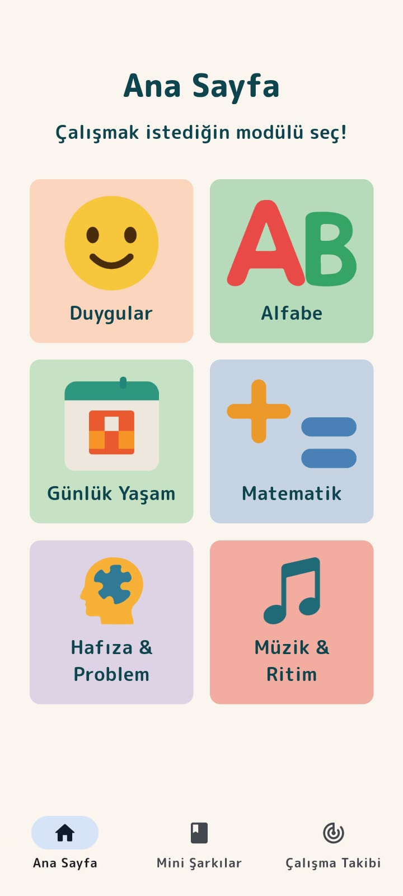
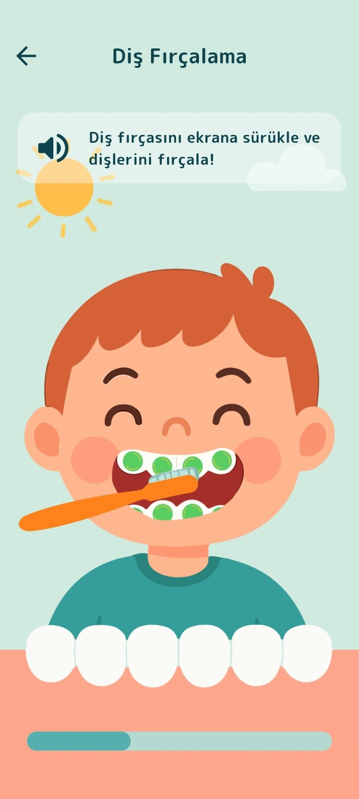
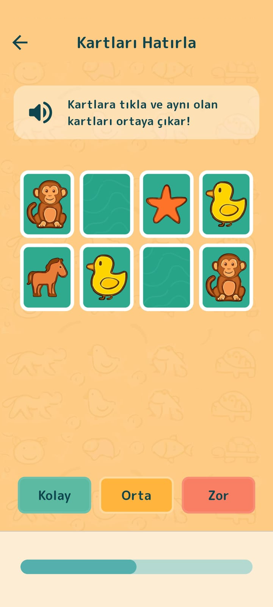

# Down Up

🎓 **Down Up** is an educational application designed to help disadvantaged students  
(e.g., Down syndrome, autism spectrum disorder, and similar conditions) learn essential skills under the supervision of their teachers and/or parents.

The goal of the project is to make learning **basic concepts and everyday skills** more accessible through structured and guided activities.

🧪 This application was developed as part of a scientific research project.

---

## ✨ Features

- 👨‍🏫 Teacher-guided learning
- 👨‍👩‍👧 Parent participation support
- 🧠 Activities designed for cognitive development
- 🎯 Focus on essential life skills
- 📱 Simple and accessible interface for students

---

## 🧧 Skills Practiced

Students can practice and develop:

- 🔢 Numbers  
- 🔷 Shapes  
- 😊 Emotions  
- 🤝 Social behaviors
- 📚 Memory exercises
- ➕ Basic arithmetic

---

## 📸 Screenshots

### Figure 3.1

### Figure 3.2

### Figure 3.3

---

## 🚀 Project Vision

Down Up aims to support **special education environments** by providing a digital tool that helps teachers and parents guide students through meaningful learning activities.

The focus is not only on academic skills, but also on **practical and social development**.

---

## 🛠 Tech Stack

- Python
- Flet
- Flutter
- Dart
- Firebase

---

## 📂 Project Structure

src/ # Application source code

docs/ # Screenshots and documentation

---

## 🤝 Contributing

Contributions, suggestions, and improvements are welcome.

1. Fork the repository
2. Create a feature branch
3. Commit your changes
4. Open a pull request

---

## 📜 License

This project is licensed under the **Creative Commons Attribution-NonCommercial 4.0 International (CC BY-NC 4.0)** License.

You are free to:
- use
- modify
- share

the code for **non-commercial purposes only**.

Commercial use of this project or its derivatives is **not permitted** without explicit permission from the author.
